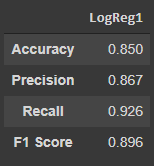

# drug-analysis-and-recommendation
The project consists of Analysis of Drug data and based on these analysis a model was implemented for recommendation

### What is implemented ? ###

I have analyzed the data using libraries like:
* matplotlib
* seaborn
* wordcloud

On the basis of the analysis I have cleaned the data and added a column 'Sentiment' in the Dataset. 
Then on the basis of this sentiment a Logistic Regression Model is implemented. 
The Resuts are displayed below.

### Results ###

